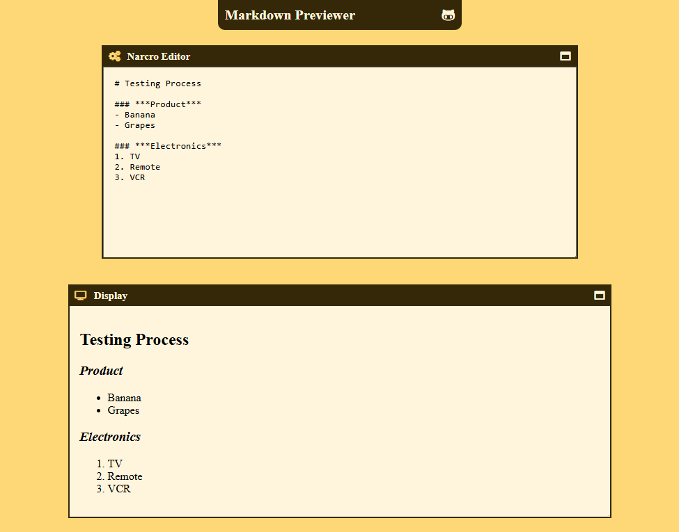

# React Markdown Previewer  

A simple and interactive Markdown previewer built with React. This project allows users to type Markdown syntax into an input area and see a live preview rendered in real-time.  

## Features  

- **Live Preview**: See the rendered Markdown content as you type.  
- **Separate Input and Preview Areas**: Clear distinction between the input and the rendered content.  
- **Responsive Design**: Works seamlessly on different screen sizes.  
- **Custom Styling**: Styled to provide a clean and user-friendly interface.  

## Preview  

  
*A screenshot of the Markdown previewer in action.*

## Installation  

Follow these steps to set up the project locally:  

1. Clone the repository:  
   ```bash
   git clone https://github.com/nhope123/previewer.git
   cd previewer

2. Install dependencies:
    ```bash
    npm install
3. Start the development server:
   ```bash
   npm start
4. Open your browser and navigate to http://localhost:3000.

## Usage
Type Markdown syntax in the input area on the left.
The rendered Markdown will be displayed in real-time in the preview area on the right.

## Example Markdown Syntax
```markdown
# Heading 1  
## Heading 2  
### Heading 3  

- List Item 1  
- List Item 2  

**Bold Text**  
*Italic Text*  

[Link](https://example.com)  

> Blockquote  

`Inline Code`  

```javascript
// Code Block  
console.log("Hello, world!");
```

## License
This project is licensed under the MIT License - see the [LICENSE](LICENSE.md) file for details.

## Acknowledgements
Thanks to the open-source community for inspiration and tools.
Special thanks to Marked.js, Dompurify, serialize-javascript for Markdown rendering.

